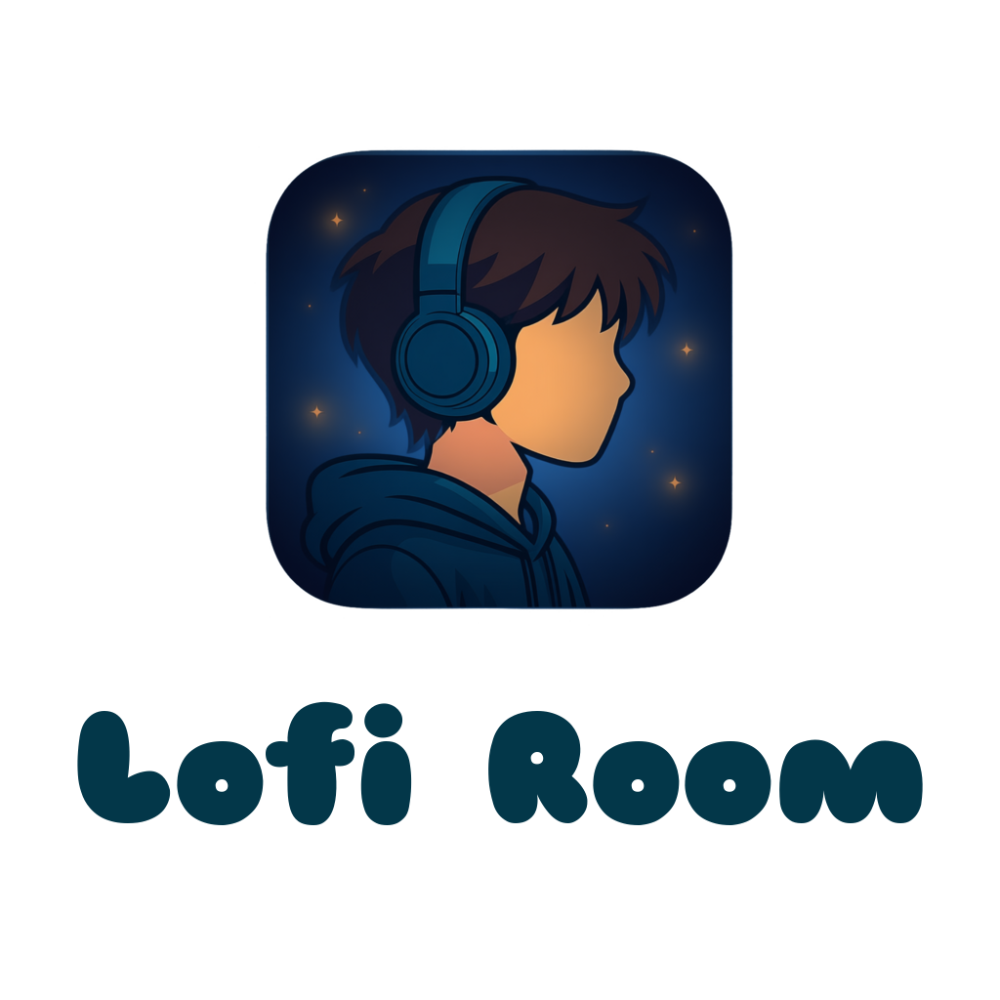
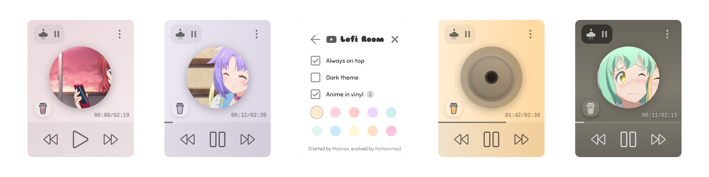
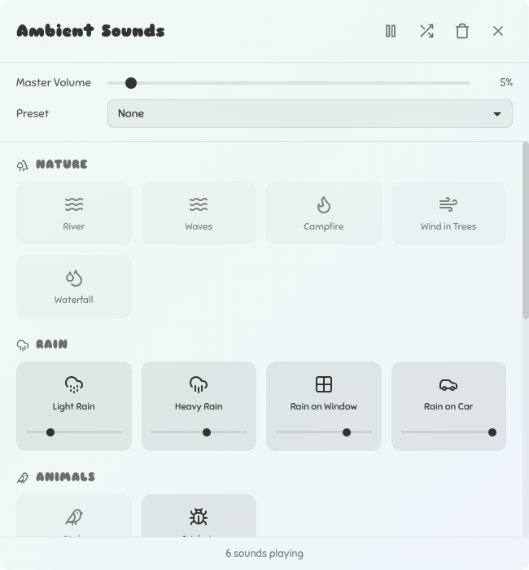
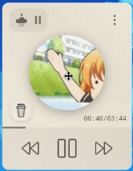

# Lofi Room Desktop App

**A minimalist lofi music player with ambient sounds and pleasing visuals**

<div align="center">
    



</div>

<p align="center">
  
  
  
  <a href="https://buymeacoffee.com/mhmdiokrm"></a>
</p>

---

## ✨ Features

- **24/7 Lofi Music Stream** - Enjoy an endless stream of hundreds of high-quality lofi beats, curated and created for the [Lofi Room YouTube channel](https://www.youtube.com/@Just-Lofi-Room). Each track is carefully selected to maintain that perfect study/work vibe.

- **Anime Visuals** - Bring your lofi experience to life with dynamic anime GIFs that perfectly complement the common lofi mood and atmosphere.

- **Adaptive Colors** - The UI automatically extracts and adapts colors from the current anime image, creating a seamless and pleasant visual experience that flows with the music.

- **Ambient Sounds** - Choose from tens of carefully selected ambient sounds embedded within the app. As a lofi listener myself, I know how important the right background atmosphere is for focus and relaxation.

- **Complete Control** - Fine-tune your perfect soundscape with volume control for the music stream, individual volume controls for each ambient sound, and a master volume control for all sounds combined.

- **Themes & Colors** - Switch between light and dark themes to match your preference and lighting conditions. Choose from a curated color palette or let the app automatically match colors with the anime visuals.

### Ambient Sounds



Mix and match ambient sounds to create your perfect atmosphere for studying, working, or relaxing.

### Volume Controller



- Use your mouse wheel anywhere in the window to adjust the beats volume.
- Hover on the ambient sounds container specifically and now you can control the sounds master volume.

## 🚀 Installation

### Download Pre-built Packages

**Latest Release:** [Download from Releases page](https://github.com/mhmdkrmabd/lofi-room-desktop-app/releases)

### Build from Source

**Prerequisites:**

- Node.js (v16 or higher)
- npm or yarn

**Steps:**

1. Clone the repository:
   
   ```bash
   git clone https://github.com/mhmdkrmabd/lofi-room-desktop-app.git
   cd lofi-room-desktop-app
   ```

2. Install dependencies:
   
   ```bash
   npm install
   ```

3. Run in development mode:
   
   ```bash
   npm start
   ```

4. Build for production:
   
   ```bash
   npm run package
   ```
   
   The packaged application will be in the `out/` directory.

## 🛠️ Development

### Tech Stack

- **Framework:** Electron
- **UI:** Vue.js 2
- **Build:** Webpack + Electron Forge
- **Language:** TypeScript
- **Styling:** CSS with dynamic theming

### Development Commands

```bash
# Start development server
npm start

# Package the app
npm run package

# Lint code
npm run lint
```

## 🤝 Contributing

Contributions are welcome and greatly appreciated! The issues section is open for bug reports, feature requests, and general discussions.

### How to Contribute

1. **Fork** the repository
2. **Create** a feature branch (`git checkout -b feature/AmazingFeature`)
3. **Commit** your changes (`git commit -m 'Add some AmazingFeature'`)
4. **Push** to the branch (`git push origin feature/AmazingFeature`)
5. **Open** a Pull Request

### Guidelines

- Follow the existing code style
- Test your changes thoroughly
- Update documentation as needed
- Be respectful and constructive in discussions

## 💝 Special Thanks

- **Original Creator** - [Maanex](https://maanex.me/) - Thank you for creating the original concept and starting this amazing project. The original project was licensed under ISC.

- **Anime GIFs** - [OtakuGIFs API](https://otakugifs.xyz) - Huge thanks for providing the amazing anime GIF API service.

- **Ambient Sounds** - [Moodist by remvze](https://github.com/remvze/moodist) - Special thanks for providing high-quality ambient sounds available for this project. Licensed under MIT.

## 💖 Support

Love Lofi Room? Here's how you can support the project:

- 🎵 **Subscribe** to the YouTube Channel: [Lofi Room - YouTube](https://www.youtube.com/@Just-Lofi-Room)
- ☕ **Buy me a coffee**: [buymeacoffee.com/mhmdiokrm](https://buymeacoffee.com/mhmdiokrm)
- ⭐ **Star** this repository on GitHub
- 🐛 **Report bugs** or suggest features in the Issues section

## ⚠️ Important Notice - Music Streaming Server

**Please read carefully:**

The music streaming endpoint used by this application is a **private server** owned and operated by the project maintainer. This server provides access to over **1,000+ original lofi tracks** (with more being created regularly) that were specifically created for the [Lofi Room YouTube Channel](https://www.youtube.com/@Just-Lofi-Room).

### Important Points:

- ✅ **For App Use Only** - The streaming endpoint is provided exclusively for use within this Lofi Room Desktop App
- ❌ **Do Not Call Directly** - Please do not call, scrape, or access this endpoint directly outside of the app
- ❌ **No Unauthorized Use** - Do not attempt to use, redistribute, or integrate this endpoint in other projects
- ❌ **No Abuse** - Please respect the server resources and do not abuse the system
- 📧 **Need Access?** - For any special use cases or permissions, please contact: [contact@mhmd.io](mailto:contact@mhmd.io)

### Copyright & Credits:

All music tracks streamed through this endpoint are **original compositions** created by Mohammed for the [Lofi Room YouTube channel](https://www.youtube.com/@Just-Lofi-Room). All rights, credits, and copyrights are reserved. The streaming endpoint is **NOT** part of this project's open-source MIT license.

Thank you for respecting these terms and helping keep this free service available for everyone! 🎵

</div>
